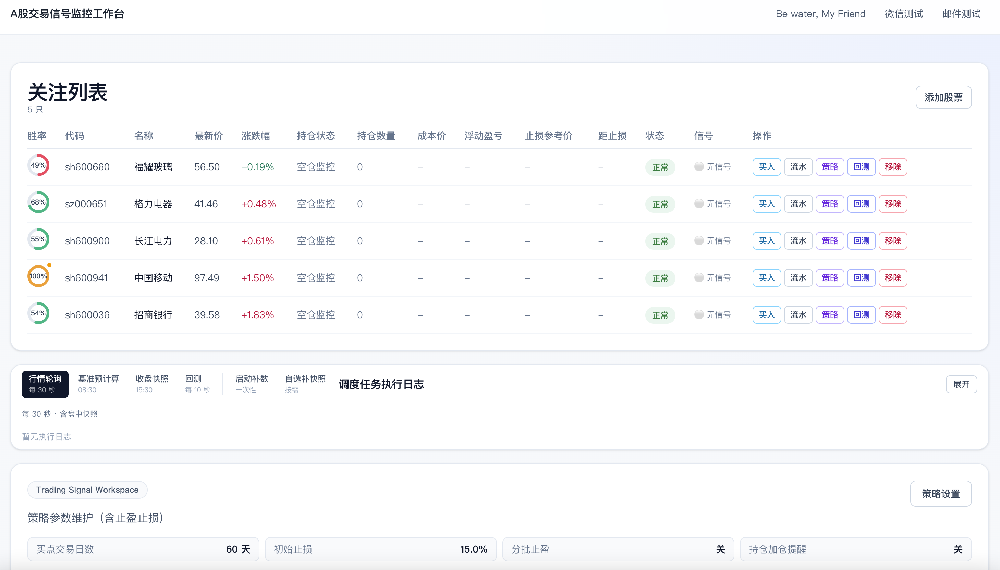
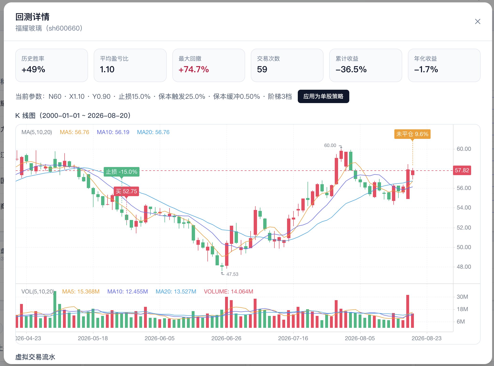

# AMTSM

[English](README.md) | [中文](README.Zh-CN.md)

A-share trading signal monitor and alert system.

## Goals

Help experienced A-share investors who cannot watch the market all day:

- Monitor a personal watchlist and surface buy/sell opportunities from an N-day high/low range strategy.
- Track registered positions and alert on stop-loss / take-profit so losses do not run and gains are not given back.
- Backtest parameter sets against history (and, for core holdings, against buy-and-hold) so settings are evidence-based rather than guesswork.
- Deliver alerts over WeChat and/or email; the user still trades by hand.

This project does **not** place orders or sync broker positions.

**Watchlist workspace.** Monitor a personal watchlist: latest price, position P&L, stop-loss reference, and strategy signals in one place. Register positions by hand; alerts go out over WeChat and/or email.

**Backtest detail.** Evaluate a parameter set against history—win rate, P/L ratio, drawdown, and marked entries/exits on the K-line—so settings are evidence-based rather than guesswork.

## Stack
- Backend: Python 3.12, FastAPI, APScheduler, SQLite
- Frontend: Next.js, TypeScript, pnpm
- Storage: SQLite with WAL mode

## Monorepo Layout
- docs/: product and design docs
- backend/: API service, scheduler and engine skeleton
- frontend/: web UI skeleton
- deploy/: Docker Compose, Dockerfiles, and nginx config
- scripts/: local start scripts

## Quick Start
### 1) Backend
1. Install uv and Python 3.12.
2. Run in backend directory:
   - uv sync
   - uv run uvicorn app.main:app --reload --host 0.0.0.0 --port 8000

### 2) Frontend
1. Run in frontend directory:
   - pnpm install
   - pnpm dev
2. Open http://localhost:3000

### 3) Docker (backend + frontend + nginx)
Images are pinned to **Python 3.12**, **Node 22**, and **pnpm 11.20.0**. Python packages come from `backend/uv.lock` (`uv sync --frozen --no-dev`); Node packages come from `pnpm-lock.yaml` (`pnpm install --frozen-lockfile`). Do not use `python:latest` / `node:latest` or unlocked `pip` / `npm` installs.

Local `uv` / `pnpm dev` and Docker use **separate** env files:

1. Local: copy `backend/.env.example` → `backend/.env` and `frontend/.env.example` → `frontend/.env`.
2. Docker: copy `deploy/.env.backend.example` → `deploy/.env.backend` and fill WeChat / SMTP (and `CORS_ORIGINS` if you open the UI from a host other than `localhost`). Do not reuse `backend/.env` or `frontend/.env`.
3. Optionally copy `deploy/.env.example` to `deploy/.env` to change `HTTP_PORT` or `SQLITE_DATA_DIR`. Docker builds with an empty `NEXT_PUBLIC_API_BASE_URL` so the browser calls same-origin `/api` through nginx.
4. From `deploy/`:
   - `docker compose up -d --build`
5. Open http://localhost (or `http://localhost:$HTTP_PORT`). `docker compose up -d` also starts `cloudflared`; copy `deploy/cloudflared/*.example` and fill tunnel credentials first. See [deploy/README.md](deploy/README.md).

nginx is the only published port. It proxies `/` to Next.js and `/api/` (including SSE) to FastAPI. SQLite is bind-mounted from the host (`deploy/data` by default, overridable via `SQLITE_DATA_DIR`) to `/data/amtsm.db` in the backend container, so rebuilds do not overwrite it.

## Notification Channels

Buy/sell alerts go out over the text channels listed in `NOTIFY_CHANNELS` (comma-separated, default `wechat`). Valid values: `wechat`, `email`, or `wechat,email`. An alert is recorded as successful if at least one selected channel sends successfully.

### WeChat (WeCom)
Buy/sell alerts can be sent as WeCom (Enterprise WeChat) app messages via wechatpy. Setup:

1. Create an app in the WeCom admin console and note the CorpID, AgentId, and Secret.
2. Make sure recipients have joined the enterprise and you know their UserIDs.
3. Copy `.env.example` to `backend/.env` (or `.env` at the repo root) and set:
   - `WECHAT_CORP_ID`
   - `WECHAT_AGENT_ID`
   - `WECHAT_SECRET`
   - `WECHAT_TO_USER` (separate multiple users with `|`, e.g. `zhangsan|lisi`, or use `@all`)
4. The dependency is already included in `uv sync` (`wechatpy[cryptography]`).
5. If `NOTIFY_CHANNELS` includes `wechat` and `WECHAT_SELF_CHECK_ON_STARTUP=true`, the backend sends a connectivity self-check (a test text message) on startup. Failure does not crash the process; the channel is marked unavailable.
6. Status: `GET /api/notify/wechat/status`. Manual self-check: `POST /api/notify/wechat/self-check`.

The Secret never appears in the status API or ordinary application logs.

### Email (SMTP)
1. Set `SMTP_HOST`, `SMTP_FROM`, and `SMTP_TO` (comma-separated for multiple recipients).
2. Login name is `SMTP_USERNAME` (`SMTP_USER` is also accepted). If it is unset and a password is configured, `SMTP_FROM` is used. Public providers such as 126/QQ require login; the password is usually a client authorization code, not the mailbox login password.
3. Port `587` uses STARTTLS (`SMTP_USE_TLS=true`). Port `465` automatically uses implicit SSL (`SMTP_USE_SSL` is not required). Using plaintext SMTP on 465 will hang until timeout.
4. If `NOTIFY_CHANNELS` includes `email` and `SMTP_SELF_CHECK_ON_STARTUP=true`, a self-check email is sent on startup. Failure does not crash the process.
5. Status: `GET /api/notify/email/status`. Manual self-check: `POST /api/notify/email/self-check`. Admin UI: `/admin/email`.

## Notes
- SQLite file path defaults to data/amtsm.db
- Database schema is initialized on API startup
- WAL mode is enabled during initialization
